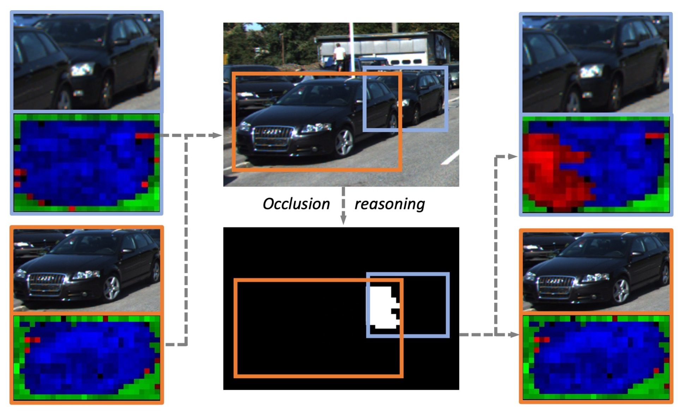
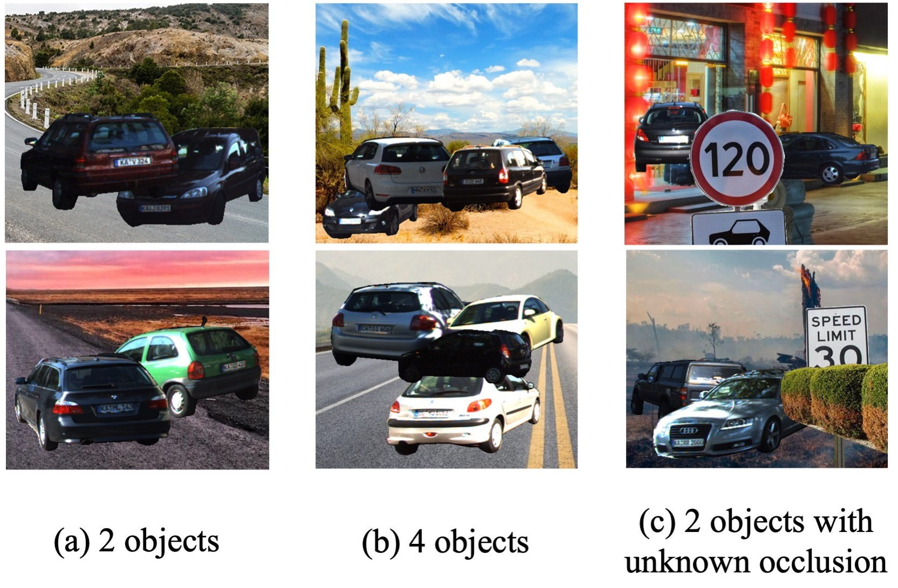
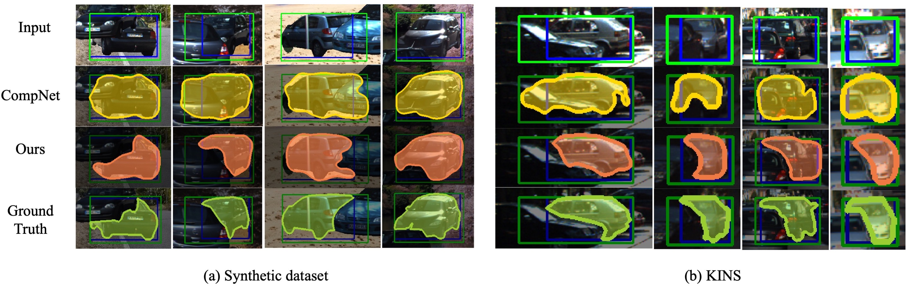

# [Robust Instance Segmentation through Reasoning about Multi-Object Occlusion](https://arxiv.org/abs/2012.02107)




### Abstract

Analyzing complex scenes with DNN is a challenging task, particularly when images contain multiple objects that partially occlude each other. Existing approaches to image analysis mostly process objects independently and do not take into account the relative occlusion of nearby objects. We propose a deep network for **multi-object instance segmentation** that is robust to occlusion and can be trained from **bounding box supervision only**. 

We also introduce an **Occlusion Challenge** dataset generated from real-world segmented objects with accurate annotations and propose a taxonomy of occlusion scenarios that pose a particular challenge for computer vision.




------------

### Requirments
The code uses Python 3.6 and it is tested on PyTorch GPU version 1.2, with CUDA-10.0 and cuDNN-7.5.

### Installation
1. Clone the repository with:
```
git clone https://github.com/XD7479/Multi-Object-Occlusion.git
cd Multi-Object-Occlusion
```
2. Install requirments:
```
pip install -r requirements.txt
```
### Datasets
1. Download the KINS dataset here and the Occlusion Challenge dataset here.
2. Enter the project folder and make links for the datasets:
```
ln -s <YOUR_KINS_DATASET_PATH> kins
ln -s <YOUR_OCC_CHALLENGE_DATASET_PATH> occ_challenge
```
3. Download the pre-trained model here.
4. Make links for the pre-trained model:
```
ln -s <YOUR_MODEL_PATH> models
```
7. Check the configuration file `configs.py` for the dataset and backbone you're using:
```
dataset_eval = 'occ_challenge'      # kins, occ_challenge
nn_type = 'resnext'             # vgg, resnext

```
9. Run the evaluation code with:
```
python3 eval_meanIoU.py
```

-----------
### Segmentation Demo




### Citation

```
@misc{yuan2021robust,
      title={Robust Instance Segmentation through Reasoning about Multi-Object Occlusion}, 
      author={Xiaoding Yuan and Adam Kortylewski and Yihong Sun and Alan Yuille},
      year={2021},
      eprint={2012.02107},
      archivePrefix={arXiv},
      primaryClass={cs.CV}
}
```

### Contact
If you have any questions you can contact Xiaoding Yuan by xiaodingyuan.tj@gmail.com.


